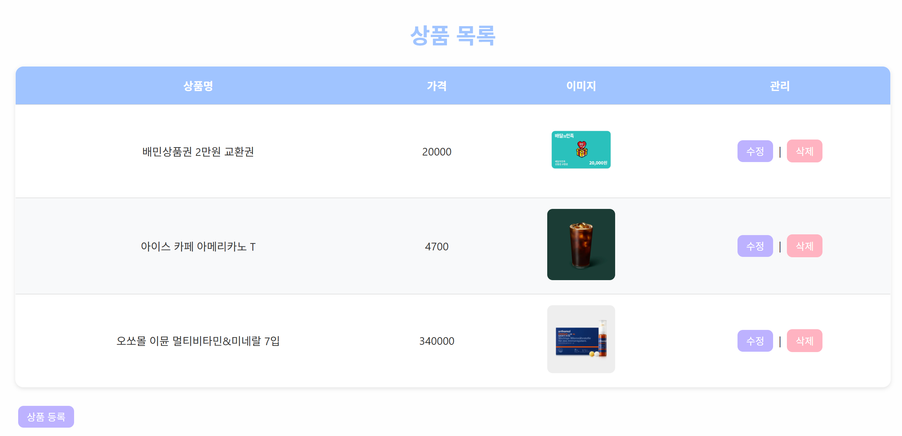

# spring-gift-product

# [step1] 상품 API 구현


상품의 등록, 조회, 수정, 삭제 기능을 제공하는 RESTful API구현
(HTTP 요청 및 응답은 JSON 형식)

## 구현 기능 목록

- [x] 상품 등록 API (POST `/api/products`)
- [x] 상품 단건 조회 API (GET `/api/products/{productId}`)
- [x] 상품 전체 목록 조회 API (GET `/api/products`) - 페이지네이션은 DB 연동 후 구현 예정
- [x] 상품 수정 API (PUT `/api/products/{productId}`)
- [x] 상품 삭제 API (DELETE `/api/products/{productId}`)


## 기능별 요청/응답 예시

### 1) 상품 등록 API (POST `/api/products`)

#### request

```json
{
  "name": "아이스 카페 아메리카노 T",
  "price": 4700,
  "imageUrl": "https://image.istarbucks.co.kr/upload/store/skuimg/2021/04/[110563]_20210426095937947.jpg"
}
```
#### response 
```json
{
  "id": 1,
  "name": "아이스 카페 아메리카노 T",
  "price": 4700,
  "imageUrl": "https://image.istarbucks.co.kr/upload/store/skuimg/2021/04/[110563]_20210426095937947.jpg"
}
```
---
### 2) 상품 단건 조회 API (GET `/api/products/{productId}`)

#### 200 response (`/api/products/1`)
```json
{
  "id": 1,
  "name": "아이스 카페 아메리카노 T",
  "price": 4700,
  "imageUrl": "https://image.istarbucks.co.kr/upload/store/skuimg/2021/04/[110563]_20210426095937947.jpg"
}
```
#### 404 response
```json

```
---
### 3) 상품 목록 전체조회 API (GET `/api/products`)

#### 200 response (`/api/products`)
```json
[
  {
    "id": 1,
    "name": "배민상품권 2만원 교환권",
    "price": 20000,
    "imageUrl": "https://st.kakaocdn.net/product/gift/product/20230830170233_21660381ee6d4c06ac0abe956468d0d2.png"
  },
  {
    "id": 2,
    "name": "아이스 카페 아메리카노 T",
    "price": 4700,
    "imageUrl": "https://image.istarbucks.co.kr/upload/store/skuimg/2021/04/[110563]_20210426095937947.jpg"
  }
]
```
---
### 4) 상품 수정 API (PUT `/api/products/{productId}`)

#### request (`/api/products/1`)
```json
{
  "price": 4900

}
```
#### response 
```json
{
  "id": 1,
  "name": "아이스 카페 아메리카노 T",
  "price": 4900,
  "imageUrl": "https://image.istarbucks.co.kr/upload/store/skuimg/2021/04/[110563]_20210426095937947.jpg"
}
```
---
### 5) 상품 삭제 API (DELETE `/api/products/{productId}`)

#### response (`/api/products/1`)
```
  성공 시 204, 실패 시 404
```
---

# [step2] 관리자 화면 구현

## 구현 기능 목록

- [x] 상품 목록 조회 화면
- [ ] 상품 등록 화면
- [ ] 상품 수정 화면
- [ ] 상품 삭제 기능


## 기능별 화면 예시

### 상품 목록 조회 화면



